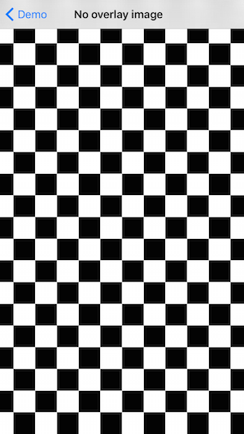

# UIImage-ASWhiteColorToAlpha

##When do I need it?

This is our original image:


This is our background:



We want this result:


... which looks like this on white backgroud:


##How it works?

1. Copy the `/UIImage_ASWhiteColorToAlpha` directory into your project.

2. Import UIImage+ASWhiteColorToAlpha.h `#import UIImage+ASWhiteColorToAlpha.h`

3. Use -[UIImage imageWithWhiteColorToAlpha] method call to get your translucent image `UIImage *myTranslucentImage = [myOriginalImage imageWithWhiteColorToAlpha];` or -[UIImage renderImageWithWhiteColorToAlpha:] which gives back the asynchronously rendered image in a completion block. 
```__block UIImage *myTranslicentImage = nil;
[myOriginalImage renderImageWithWhiteColorToAlpha:^(UIImage *translucentImage){
myTranslucentImage = translucentImage;
// Update UI
}];```

##Known issues

* Should be cached for reuse